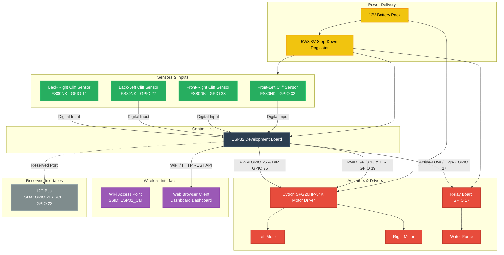
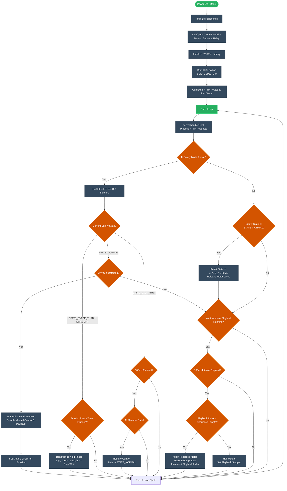
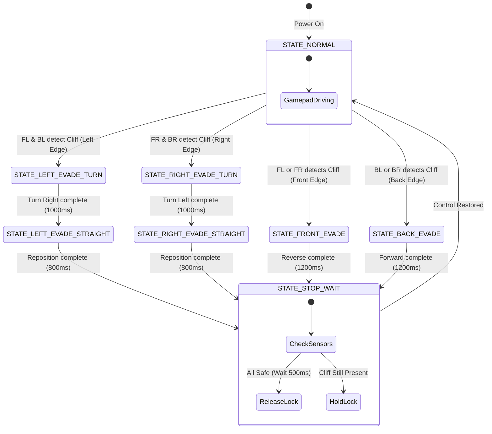

# G7 Solar Panel Cleaning Robot - System Documentation

This repository contains the baseline open-loop control firmware and interactive web dashboard for the **G7 Solar Panel Cleaning Robot**. The system features real-time manual remote control (RC), autonomous safety cliff-detection and evasion, preset movement recording and playback, and live system diagnostics.

---

## 🛠️ System Architecture

The hardware architecture revolves around an ESP32 microcontroller that interfaces with four cliff sensors, a water pump relay, and a dual-channel motor driver. The dashboard is hosted directly by the ESP32 and accessed over its local WiFi Access Point.

### Hardware Block Diagram



---

## ⚙️ System Hardware Specifications

### 1. Motor Configuration
- **Motors**: Dual Cytron SPG20HP-34K (12V 580RPM DC geared motors).
- **Speed Limits**:
  - `MAX_PWM = 60` (approx. 24% duty cycle) — enforces slow, safe, and controllable tracking speeds on the solar panel arrays.
  - `MIN_PWM = 30` — minimum starting duty cycle to overcome mechanical stiction.
  - Manual joystick controls from the dashboard gamepad (`[-255..255]`) are mapped dynamically to the `[MIN_PWM..MAX_PWM]` speed range.

### 2. Water Pump Relay
- Controlled via an optocoupler-isolated relay module mapped to `GPIO 17`.
- **High-Impedance Trick**: Active-LOW signaling triggers the relay (`LOW` = ON). To ensure the 5V relay turns OFF completely under 3.3V logic (preventing leakage currents), the GPIO pin is configured as a high-impedance `INPUT` when turning the pump OFF, and driven `OUTPUT` `LOW` to turn it ON.
- Managed directly via the dashboard buttons or controller buttons (**Button X** turns pump ON, **Button Y** turns pump OFF).

### 3. Preset Recording & Playback
- **Button A**: Toggles manual movement sequence recording (capture rate: 10 Hz).
- **Button B**: Toggles playback execution of the recorded movement sequence.
- Sequence buffer capacity is up to 3000 steps (300 seconds of runtime), stored in the ESP32 RAM for zero-latency local execution.

---

## 🔌 Wiring and Pin Map

| Component | Pin Function | ESP32 GPIO Pin | Notes |
|---|---|---|---|
| **Left Motor** | PWM Speed Control | **GPIO 18** | Connected to Cytron PWM input (LEDC channel) |
| **Left Motor** | Direction Control | **GPIO 19** | `HIGH` is backward, `LOW` is forward (inverted wiring) |
| **Right Motor**| PWM Speed Control | **GPIO 25** | Connected to Cytron PWM input (LEDC channel) |
| **Right Motor**| Direction Control | **GPIO 26** | `HIGH` is forward, `LOW` is backward |
| **Water Pump** | Relay Signal | **GPIO 17** | Active-LOW (Low = Pump ON, Input/High-Z = Pump OFF) |
| **I2C SDA** | Data line | **GPIO 21** | Untouched / Reserved for future expansion |
| **I2C SCL** | Clock line | **GPIO 22** | Untouched / Reserved for future expansion |
| **Sensor FL** | Front-Left Cliff | **GPIO 32** | FS80NK Proximity Input (`INPUT_PULLUP`) |
| **Sensor FR** | Front-Right Cliff| **GPIO 33** | FS80NK Proximity Input (`INPUT_PULLUP`) |
| **Sensor BL** | Back-Left Cliff | **GPIO 27** | FS80NK Proximity Input (`INPUT_PULLUP`) |
| **Sensor BR** | Back-Right Cliff | **GPIO 14** | FS80NK Proximity Input (`INPUT_PULLUP`) |

---

## 💻 Control Loop and Flowchart

The firmware control loop runs in a non-blocking configuration to handle client connections, process safety updates, and execute autonomous sequences concurrently.



---

## 🚦 Safety Evasion State Machine

When Safety Mode is active, manual remote control and autonomous sequence playback are bypassed immediately if any of the FS80NK infrared proximity sensors detect a cliff (air edge). The safety state machine overrides control and performs a predefined evasion maneuver.

### Safety Evasion Logic:
1. **Front Cliff (FL or FR detects)**:
   - Stops motors.
   - Moves backward (`setMotorsDirect(-255, -255)`) for `1200ms`.
   - Stops and waits for safety verification.
2. **Back Cliff (BL or BR detects)**:
   - Stops motors.
   - Moves forward (`setMotorsDirect(255, 255)`) for `1200ms`.
   - Stops and waits for safety verification.
3. **Left Cliff (FL and BL detect)**:
   - Stops motors.
   - Pivots right (`setMotorsDirect(255, -255)`) for `1000ms`.
   - Repositions straight forward (`setMotorsDirect(255, 255)`) for `800ms`.
   - Stops and waits for safety verification.
4. **Right Cliff (FR and BR detect)**:
   - Stops motors.
   - Pivots left (`setMotorsDirect(-255, 255)`) for `1000ms`.
   - Repositions straight forward (`setMotorsDirect(255, 255)`) for `800ms`.
   - Stops and waits for safety verification.

### Safety State Machine Diagram



---

## 💻 Web Server & API Endpoints

The ESP32 broadcasts a SoftAP SSID **`ESP32_Car`** (password: `password123`) and hosts the interactive dashboard on `http://192.168.4.1/`.

### Available Endpoints:
- **`GET /`**: Serves the dashboard HTML interface.
- **`GET /drive?l=[speed]&r=[speed]&p=[0/1]`**:
  - Updates motor speeds (scaled from `-255..255`) and water pump relay state (`p=1` for ON, `p=0` for OFF).
  - *Note: These commands are ignored if safety override maneuvers or preset playbacks are running.*
- **`GET /set_safety?active=[0/1]`**:
  - Enables (`active=1`) or disables (`active=0`) the active safety cliff-evasion state machine.
- **`GET /set_pump?active=[0/1]`**:
  - Direct control endpoint to toggle the water pump ON/OFF.
- **`POST /upload_preset`**:
  - Receives a movement sequence formatted as `l,r,p;l,r,p;...` in the POST payload and writes it directly to ESP32 memory.
- **`GET /playback?action=[play/pause/stop/clear]`**:
  - Controls playback actions for autonomous sequence execution.
- **`GET /status`**:
  - Queries real-time telemetry variables from the ESP32:
    ```json
    {
      "fl": false,
      "fr": false,
      "bl": false,
      "br": false,
      "safety": "NORMAL",
      "playStatus": "STOPPED",
      "playIndex": 0,
      "playLen": 0,
      "safetyMode": false,
      "pump": false,
      "uptime": 234850,
      "rssi": -48,
      "clients": 1
    }
    ```
- **`GET /log`**:
  - Returns the rolling event log buffer stored in ESP32 RAM as JSON:
    ```json
    [
      {"t":10240,"msg":"[WiFi] Client connected"},
      {"t":12450,"msg":"Safety mode ENABLED (Cleaning)"},
      {"t":14500,"msg":"Water pump turned ON"}
    ]
    ```
- **`GET /testleft` / `GET /testright`**: Turns left or right motor forward at `MAX_PWM` for hardware wiring debugging.
- **`GET /teststop`**: Emergency halts motors immediately.
- **`GET /estop`**: Emergency stop that halts motors, pump, and halts playback immediately.

---

## 🔍 Troubleshooting and Calibration

1. **Active Logic Tuning**:
   - The FS80NK output is active HIGH (`#define CLIFF_STATE HIGH` means high when cliff is detected). If your sensors output active LOW (LOW for cliff, HIGH for surface), update the macro in [SolarPanelG7RC.ino](file:///c:/Users/Victus/OneDrive/Desktop/IDP/SolarPanelG7RC/SolarPanelG7RC.ino) to `LOW`.
2. **Detection Threshold Adjustment**:
   - Locate the screw potentiometer on the back of each FS80NK sensor. Adjust the potentiometer using a flathead screwdriver until the indicator LEDs turn off cleanly when the robot reaches the edge of the panel.
3. **Safety Override Mode**:
   - If sensors are physically disconnected or damaged, they pull the inputs to HIGH (triggering safety lock). Bypass the safety state machine using the "Bypass Safety" button on the dashboard or by pressing **Button R1 (Right Bumper)** on your controller to restore manual operation.
