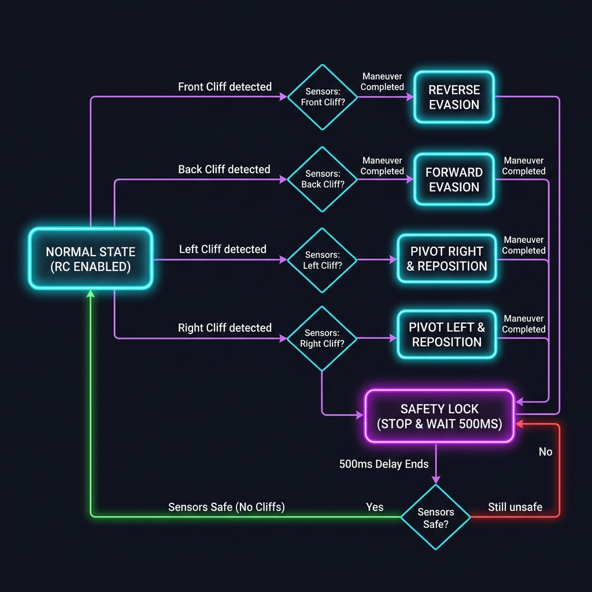
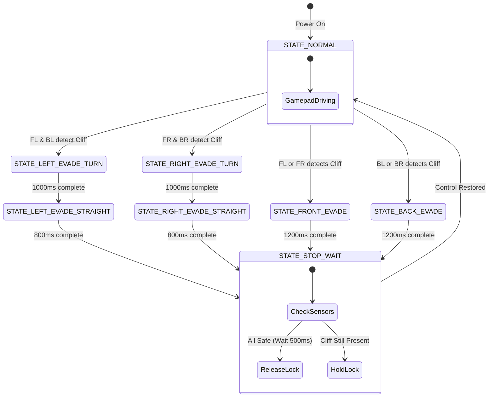

# G7 Solar Panel Cleaning Robot - System Documentation

This repository contains the firmware and dashboard for the G7 Solar Panel Cleaning Robot in two distinct system architectures:

1. **Open-Loop Version** ([SolarPanelG7RC.ino](file:///c:/Users/Victus/OneDrive/Desktop/IDP/SolarPanelG7RC/SolarPanelG7RC.ino)): Focuses on manual remote control (RC) and the autonomous safety cliff-detection and evasion system powered by four FS80NK infrared proximity sensors.
2. **Closed-Loop Version** (in the [SolarPanelG7RC_ClosedLoop](file:///c:/Users/Victus/OneDrive/Desktop/IDP/SolarPanelG7RC/SolarPanelG7RC_ClosedLoop) folder): Re-integrates the **GY-85 9DOF IMU** to add **Straight-Line Assist (Heading Lock)** and **Slope-Speed Compensation** with real-time web-adjustable PID sliders. See the [Closed-Loop README](file:///c:/Users/Victus/OneDrive/Desktop/IDP/SolarPanelG7RC/SolarPanelG7RC_ClosedLoop/README.md) for full details.

---

## ⚙️ System Hardware Specifications

### 1. Motor Configuration
- **Motors**: Cytron SPG20HP-34K (12V 580RPM)
- **Speed Limits**:
  - `MAX_PWM = 60` (approx. 24% duty cycle) — ensures controllable tracking speeds.
  - `MIN_PWM = 30` — overcomes stiction to start motor rotation.
  - Joystick inputs are scaled from range `[-255..255]` to `[MIN_PWM..MAX_PWM]`.

### 2. Water Pump Relay
- Controlled via a relay module connected to `GPIO 17` (active low).
- Managed via the gamepad dashboard (Button X turns the pump ON, Button Y turns it OFF).

### 3. Preset Recording & Playback Shortcuts
- **Button A** toggles **Start/Stop Recording** of your manual movements.
- **Button B** toggles **Play/Pause Playback** of the recorded sequence.
- Presets are captured at 10 Hz in the browser and uploaded to ESP32 RAM for autonomous local execution.

---

## 🔌 Wiring and Pin Map

| Component | Pin Function | ESP32 GPIO Pin | Notes |
|---|---|---|---|
| **Left Motor** | PWM Speed Control | **GPIO 18** | Connected to Cytron PWM input |
| **Left Motor** | Direction Control | **GPIO 19** | `HIGH` is forward, `LOW` is backward |
| **Right Motor**| PWM Speed Control | **GPIO 25** | Connected to Cytron PWM input |
| **Right Motor**| Direction Control | **GPIO 26** | `HIGH` is forward, `LOW` is backward |
| **Water Pump** | Relay Signal | **GPIO 17** | Active LOW (Low turns pump ON) |
| **I2C SDA** | Data line | **GPIO 21** | Untouched/Reserved for future sensors |
| **I2C SCL** | Clock line | **GPIO 22** | Untouched/Reserved for future sensors |
| **Sensor FL** | Front-Left Cliff | **GPIO 32** | FS80NK Input (`INPUT_PULLUP`) |
| **Sensor FR** | Front-Right Cliff| **GPIO 33** | FS80NK Input (`INPUT_PULLUP`) |
| **Sensor BL** | Back-Left Cliff | **GPIO 27** | FS80NK Input (`INPUT_PULLUP`) |
| **Sensor BR** | Back-Right Cliff | **GPIO 14** | FS80NK Input (`INPUT_PULLUP`) |

---

## 🚦 Safety Evasion State Machine

The robot runs a non-blocking safety state machine in its loop. When a cliff is detected, **manual RC gamepad control is immediately disabled**, and an automatic evasion maneuver is performed. Control is only restored once all sensors are confirmed safe.

### Evasion Maneuver Logic:
1. **Front Cliff (FL or FR detects)**:
   - Halts motors.
   - Reverses (moves backward) for `1200ms`.
   - Halts and enters verification state.
2. **Back Cliff (BL or BR detects)**:
   - Halts motors.
   - Drives forward for `1200ms`.
   - Halts and enters verification state.
3. **Left Cliff (FL and BL detect)**:
   - Halts motors.
   - Pivots right (Left forward, Right backward) for `1000ms`.
   - Moves straight forward for `800ms`.
   - Halts and enters verification state.
4. **Right Cliff (FR and BR detect)**:
   - Halts motors.
   - Pivots left (Right forward, Left backward) for `1000ms`.
   - Moves straight forward for `800ms`.
   - Halts and enters verification state.

### State Transitions:


### State Transitions (Mermaid code):


---

## 💻 Web Server & API Endpoints

The ESP32 broadcasts a SoftAP SSID **`ESP32_Car`** (password: `password123`) and serves the dashboard on `http://192.168.4.1/`.

### Available Endpoints:
- **`GET /`**: Serves the interactive HTML control page.
- **`GET /drive?l=[speed]&r=[speed]&p=[0/1]`**:
  - Updates motor speed parameters (from `-255` to `255`) and turns the pump ON (`p=1`) or OFF (`p=0`).
  - *Ignored automatically if the safety override or autonomous playback is active.*
- **`POST /upload_preset`**:
  - Uploads a sequence of commands formatted as `l,r,p;l,r,p;l,r,p...` in the request body to the ESP32.
- **`GET /playback?action=[play/pause/stop/clear]`**:
  - Controls playback execution on the ESP32 backend.
- **`GET /status`**:
  - Returns current telemetry in JSON format:
    ```json
    {
      "fl": false,
      "fr": false,
      "bl": false,
      "br": false,
      "safety": "NORMAL",
      "playStatus": "STOPPED",
      "playIndex": 0,
      "playLen": 0
    }
    ```
- **`GET /testleft` / `GET /testright`**: Runs left or right motor forward at `MAX_PWM` for testing.
- **`GET /teststop`**: Emergency halts all motors.

---

## 🔍 Troubleshooting and Calibration

1. **Active Logic Tuning**:
   - The FS80NK output is active LOW (0 = surface detected, 1 = cliff/air). This is configured in the code via `#define CLIFF_STATE HIGH`.
   - If your sensors output active HIGH when detecting a surface, change this macro in `SolarPanelG7RC.ino` to `LOW`.
2. **Adjusting Detection Distance**:
   - There is a screw potentiometer on the back of each FS80NK sensor. Use a small flathead screwdriver to adjust the detection distance until the status LEDs on the sensor reliably turn off at the solar panel's edge.
3. **Control Locked**:
   - If the dashboard shows `⚠️ SAFETY INTERRUPT: SAFETY LOCK`, check the sensor status lights. The robot will remain locked in a stopped state if any sensor is reporting a cliff to prevent it from driving off.
