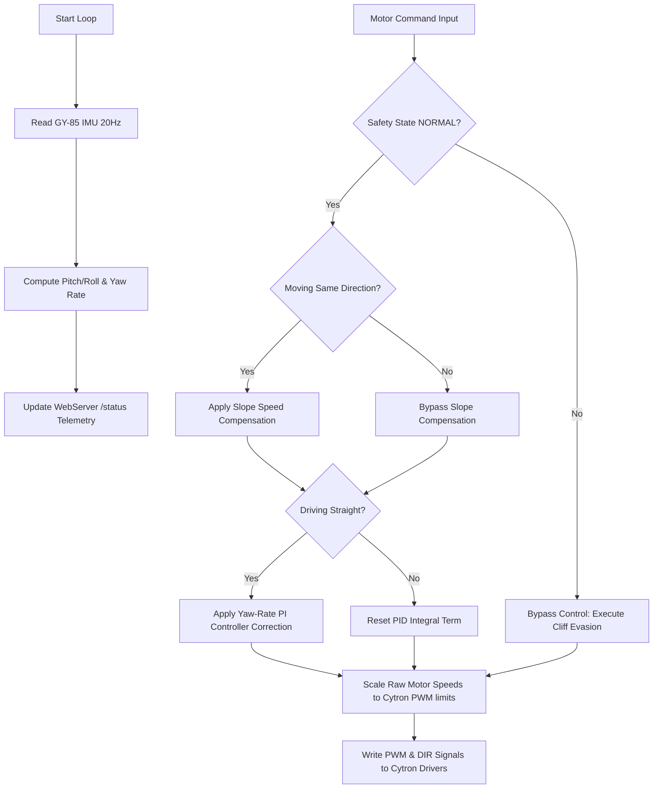

# G7 Solar Panel Cleaning Robot - Closed-Loop Control System

This subdirectory contains the closed-loop version of the G7 Solar Panel Cleaning Robot firmware and dashboard. This system re-integrates the **GY-85 9DOF IMU** to provide **Straight-Line Assist (Heading Lock)** and **Slope-Speed Compensation** without requiring wheel encoders.

---

## 🛠️ Closed-Loop System Architecture

The closed-loop version builds upon the baseline safety system (with FS80NK cliff evasion) by adding inertial sensors to stabilize the robot against slope variations and wheel drift.

### 📐 Control Loop Hierarchy Flowchart

---

## 🔌 GY-85 IMU Pin Configuration & Wiring

The GY-85 IMU is powered by `3.3V` and communicates over the shared `I2C` bus.

| Sensor Pin | ESP32 GPIO Pin | Description | I2C Address | Notes |
|---|---|---|---|---|
| **VCC** | **3.3V** | Power Supply | - | - |
| **GND** | **GND** | Ground Reference | - | - |
| **SDA** | **GPIO 21** | I2C Data Line | - | Shared bus |
| **SCL** | **GPIO 22** | I2C Clock Line | - | Shared bus |
| **ADXL345** | Shared | 3-axis Accelerometer | `0x53` | Detects Pitch & Roll tilts |
| **ITG3205** | Shared | 3-axis Gyroscope | `0x68` | Measures Yaw rate |
| **QMC5883L**| Shared | 3-axis Magnetometer | `0x0D` / `0x1E` | Compass heading |

---

## 🔢 Mathematical Formulas

### 1. Tilt Angle Estimation (Accelerometer)
Using the gravitational acceleration vector measured by the ADXL345:
$$\text{Pitch } (\theta) = \text{atan2}(-A_x, \sqrt{A_y^2 + A_z^2}) \times \frac{180}{\pi}$$
$$\text{Roll } (\phi) = \text{atan2}(A_y, A_z) \times \frac{180}{\pi}$$

### 2. Slope-Speed Compensation
To prevent the robot from slowing down when traveling uphill, the motor powers are scaled proportionally to the pitch angle ($\theta$):
$$V_{\text{comp}} = \theta \times K_{\text{slope}}$$
- When going forward ($V_{\text{target}} > 0$): $V_{\text{final}} = V_{\text{target}} + V_{\text{comp}}$
- When going backward ($V_{\text{target}} < 0$): $V_{\text{final}} = V_{\text{target}} + V_{\text{comp}}$
- $K_{\text{slope}}$ is calibrated to `1.35` PWM units per degree.

### 3. Straight-Line Assist Heading Lock
When driving straight ($L = R$ and $L \neq 0$), a PID controller acts on the gyroscope Z-axis yaw rate ($Y_{\text{rate}}$) to counter mechanical drift or wheel slippage:
$$\text{Error } (e) = 0.0 - Y_{\text{rate}}$$
$$\text{Integral } (I) = \int e \cdot dt \quad (\text{clamped to } \pm 100)$$
$$\text{Derivative } (D) = \frac{de}{dt}$$
$$\text{Correction } (C) = (K_p \cdot e) + (Ki \cdot I) + (K_d \cdot D)$$

The correction is applied differentially to the motors:
$$L_{\text{final}} = L_{\text{comp}} + C$$
$$R_{\text{final}} = R_{\text{comp}} - C$$

---

## 🎛️ Real-Time PID Web Tuning

The dashboard UI includes a **PID Tuning Card** with sliders that send debounced (150ms delay) HTTP requests to the ESP32:
- **`GET /tune_pid?kp=[val]&ki=[val]&kd=[val]`**

### Default Tuning Constants:
- **$K_p = 0.75$**: Proportional gain. Adjusts correction sensitivity.
- **$K_i = 0.08$**: Integral gain. Corrects persistent structural steering imbalances.
- **$K_d = 0.02$**: Derivative gain. Damps steering wobble and oscillation.

---

## 💻 Visual Telemetry Additions

1. **3D Pitch/Roll Tilt Disc**: Formatted using CSS `perspective` and 3D transforms (`rotateX` / `rotateY`) to display real-time physical inclination.
2. **Compass Heading Dial**: Uses CSS rotations to rotate a dial element relative to the magnetic heading, indicating the exact direction of travel.
3. **Assist Mode Status**: Displays a purple `ACTIVE` tag on the dashboard when the robot is actively applying yaw corrections.
