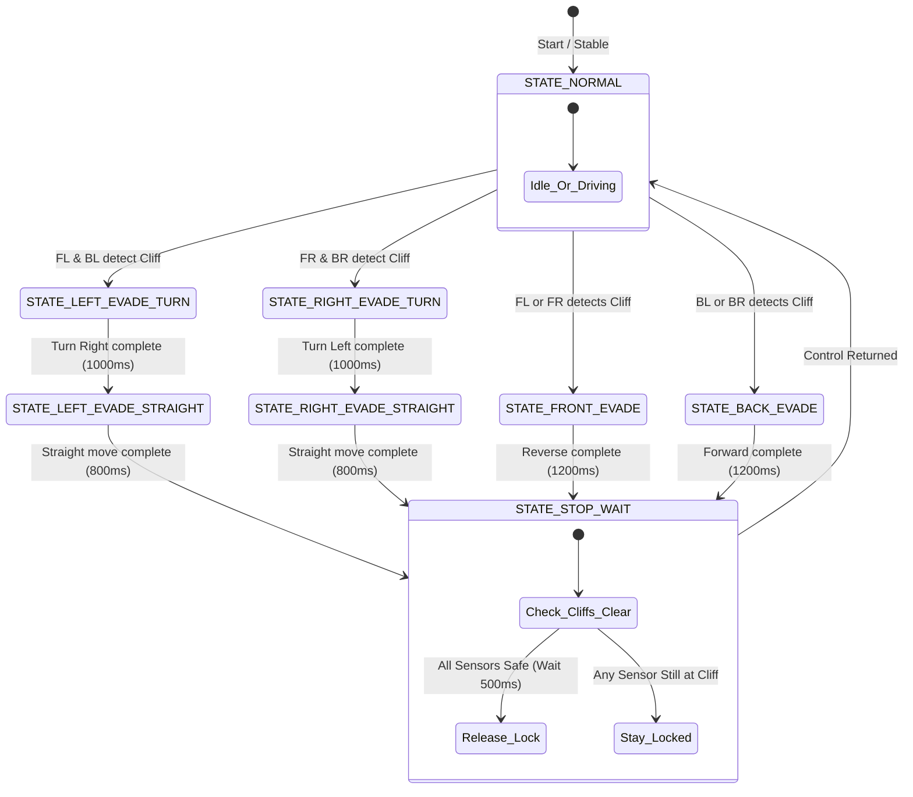
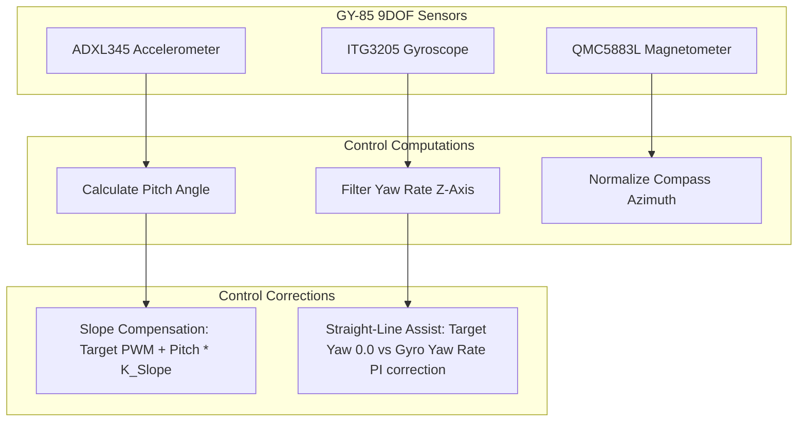

# G7 Solar Panel Cleaning Robot - Walkthrough & System Explanation

This walkthrough covers both the **FS80NK Cliff Detection and Evasion System** and the newly added **GY-85 Inertial Sensor Closed-Loop Feedback Control System**.

---

## 🛠️ System Overview & Architectures

The repository provides two separate control system configurations:
1. **Open-Loop Configuration** ([SolarPanelG7RC.ino](file:///c:/Users/Victus/OneDrive/Desktop/IDP/SolarPanelG7RC/SolarPanelG7RC.ino)): Focuses on manual remote control (RC) and the autonomous safety cliff-detection and evasion system powered by four FS80NK infrared proximity sensors.
2. **Closed-Loop Configuration** (in the [SolarPanelG7RC_ClosedLoop](file:///c:/Users/Victus/OneDrive/Desktop/IDP/SolarPanelG7RC/SolarPanelG7RC_ClosedLoop) folder): Re-integrates the GY-85 IMU to implement straight-line assist heading correction and slope speed compensation, and provides real-time PID slider tuning directly from the web dashboard.

---

## 🚦 Safety Evasion State Machine (Both Versions)

Both versions utilize a non-blocking state machine `updateSafety()` running on the ESP32. If a cliff sensor detects the edge (outputs active `HIGH`), manual RC and presets are instantly bypassed to execute an evasion maneuver:

---

## 🧭 Closed-Loop Stabilization Loop (`SolarPanelG7RC_ClosedLoop`)

In the closed-loop version, when the safety state is normal, the robot uses the GY-85 IMU to compensate for tilts and rotation:

### 1. Mathematical Logic
* **Slope Compensation**: When driving forward or backward, pitch tilt gravity pull is countered by adjusting the base speed:
  $$V_{\text{compensated}} = V_{\text{target}} + \theta_{\text{pitch}} \times K_{\text{slope}}$$
* **Straight-Line Lock**: When driving straight, yaw rotation rate is locked to `0` using a PI loop:
  $$e(t) = 0 - Y_{\text{rate}}(t)$$
  $$u(t) = K_p e(t) + K_i \int e(t) dt + K_d \frac{de(t)}{dt}$$
  $$L_{\text{output}} = V_{\text{compensated}} + u(t)$$
  $$R_{\text{output}} = V_{\text{compensated}} - u(t)$$

---

## 💻 Web Dashboard Upgrades

The closed-loop version's dashboard is fully upgraded with:
1. **Compass Card**: Integrates a virtual needle reflecting the magnetometer's azimuth.
2. **3D Tilt Orientation Card**: Embeds a CSS 3D transformed disk displaying the physical inclination (pitch/roll) of the robot.
3. **PID Tuning Card**: Adds interactive sliders to modify $K_p$, $K_i$, and $K_d$ values on the ESP32 in real time with a 150ms debouncer.
