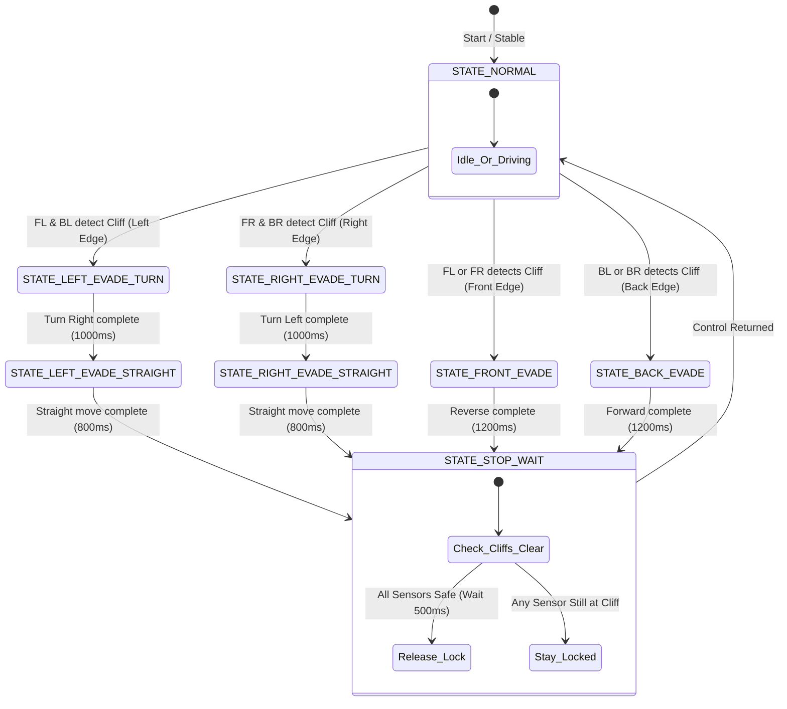

# G7 Solar Panel Cleaning Robot - Walkthrough & System Explanation

This walkthrough provides a detailed explanation of the core firmware subsystems in [SolarPanelG7RC.ino](file:///c:/Users/Victus/OneDrive/Desktop/IDP/SolarPanelG7RC/SolarPanelG7RC.ino). It covers the **FS80NK Cliff Detection and Evasion System**, the **Interactive Web Dashboard**, the **Safety Mode Override Switcher**, the **UTF-8 Charset Calibration**, and the **WiFi Diagnostics & Event Logging Systems**.

---

## 🛠️ System Overview & Firmware Structure

The G7 Solar Panel Cleaning Robot operates on an open-loop remote control (RC) configuration with a local autonomous safety layer. The architecture focuses on:
- Manual drivability through an HTML5 Gamepad-controlled web dashboard.
- A local non-blocking safety state machine driven by four FS80NK infrared proximity cliff sensors.
- Real-time event logging and signal diagnostics.
- Record and playback mechanisms that capture manual gamepad controls at 10 Hz and run them locally from ESP32 RAM.

---

## 🚦 Safety Evasion State Machine

The safety system is structured as a non-blocking finite state machine (`updateSafety()`) running in the main loop of the ESP32. 

When Safety Mode is active, the robot continually polls the cliff sensors. If a cliff is detected (sensor output = `CLIFF_STATE` / `HIGH`), the firmware bypasses manual control and executes a dedicated evasive maneuver to reposition the robot back onto a safe surface:

### Evasion Maneuver Specifications:
1. **Left Evade**: Drives left motor forward and right motor backward (`255, -255`) for 1000ms to pivot away from the left edge, then drives straight forward (`255, 255`) for 800ms.
2. **Right Evade**: Drives left motor backward and right motor forward (`-255, 255`) for 1000ms to pivot away from the right edge, then drives straight forward (`255, 255`) for 800ms.
3. **Front Evade**: Reverses both motors backward (`-255, -255`) for 1200ms to back away from the edge.
4. **Back Evade**: Drives both motors forward (`255, 255`) for 1200ms to pull forward away from the edge.
5. **Lock Verification**: Once the timed maneuvers complete, the robot halts (`0, 0`) and enters `STATE_STOP_WAIT` for a 500ms check window. It will hold the safety lock and remain stopped until all four sensors report a safe surface before restoring control to manual/playback.

---

## 💻 Web Dashboard & Interfaces

The dashboard utilizes vanilla HTML5 and CSS to deliver a premium user interface with the following integrated modules:

1. **Top-Down Robot Visualizer**: 
   - A rendered top-down preview of the G7 robot, containing status LEDs at the four corners corresponding to the FS80NK sensors.
   - Lights glow **Breathe Green** when detecting a surface (Safe) and blink **Strobe Red** when detecting a cliff.
2. **Controller Diagnostics & Visualizer**:
   - Renders a live canvas mapping the physical inputs of your connected gamepad (analog sticks, D-pad, and buttons).
   - Shows active joystick values scaled to motor output commands.
3. **Preset Recorder & Timeline Control**:
   - Displays a dynamic progress bar showing the steps recorded in RAM (up to 3000 steps at 10 Hz / 100ms interval).
   - Interactive buttons allow users to Record, Play, Stop, and Clear presets.
4. **System Health Bar & Telemetry**:
   - Shows connection latency (RTT) in milliseconds (color-coded connection bars).
   - Displays real-time motor PWM output levels for left and right channels.
   - Monitors AP-connected stations (clients) and live RSSI values.

---

## 🛡️ Safety Override / Mode Switcher

When the cliff sensors are physically disconnected or undergoing bench calibration, they pull the ESP32 input pins to `HIGH`. This is interpreted as a constant cliff detection, locking the robot out of manual remote control. To resolve this, a **Safety Mode Switcher** has been implemented:

- **Bypassed State (Normal Mode)**: Toggled via the dashboard or controller. The safety state machine is bypassed, allowing full manual operation regardless of the sensor outputs. If the robot is in a locked safety state when safety is bypassed, the locks are immediately released and the state resets to `STATE_NORMAL`.
- **Active State (Safety/Cleaning Mode)**: When activated, the safety state machine functions normally, triggering automatic evading movements when an edge is reached.
- **Toggling Mechanisms**:
  1. **Dashboard Button**: "Enable Safety/Cleaning" toggles the mode. The UI indicates status via colored pills.
  2. **Controller Shortcut**: Pressing **Button R1 / Right Bumper** on an active gamepad instantly toggles the safety override mode.

---

## 🔠 Dashboard UTF-8 Charset Calibration

To prevent rendering corruption (gibberish characters) for Unicode symbols and emojis (e.g., `🎮`, `🤖`, `⚠️`, `⚙️`) in different browsers:
- Added `<meta charset="UTF-8">` explicitly to the HTML `<head>` section of the served webpage within [SolarPanelG7RC.ino](file:///c:/Users/Victus/OneDrive/Desktop/IDP/SolarPanelG7RC/SolarPanelG7RC.ino).
- This standardizes client-side browser decoding, ensuring clean text formatting.

---

## 📶 WiFi Diagnostics & Verbose Event Logging

The firmware implements advanced wireless telemetry reporting and circular event buffers to assist in monitoring the robot's performance during operation:

### 1. Connection Quality Telemetry
- **Station Count**: Monitored via `WiFi.softAPgetStationNum()` to display how many controllers or dashboards are connected.
- **Station RSSI**: Monitored on the AP side using `esp_wifi_ap_get_sta_list()` to record the signal strength (dBm) of the active dashboard client.
- **RTT Latency Feedback**: The browser tracks the RTT of `/status` polling requests and passes it back to the ESP32 via `/status?rtt=XXX`. 

### 2. Event Log Buffer
The ESP32 maintains a 20-entry circular log buffer in RAM. Events are printed to the Serial Monitor and logged into this buffer. The log data is fetched by the dashboard via `/log` and displayed in a scrollable, color-coded terminal card:
- `[WiFi] Weak signal: -XX dBm` (warning triggered when signal drops below -80 dBm)
- `[WiFi] High latency: XXX ms` (warning triggered when RTT exceeds 350ms)
- `[REC] Saved preset: X steps` (triggered upon successful preset uploads)
- `[PLAY] Started/resumed playback` / `Playback complete` (triggered during playback lifecycles)
- `FRONT/BACK/LEFT/RIGHT CLIFF detected - evading...` (triggered when safety evasion starts)
- `Safety clear - control returned to RC` (triggered when safety lock is successfully released)

All logs are viewable live on the web page and can be downloaded as a standard CSV file using the **Download CSV** button.
