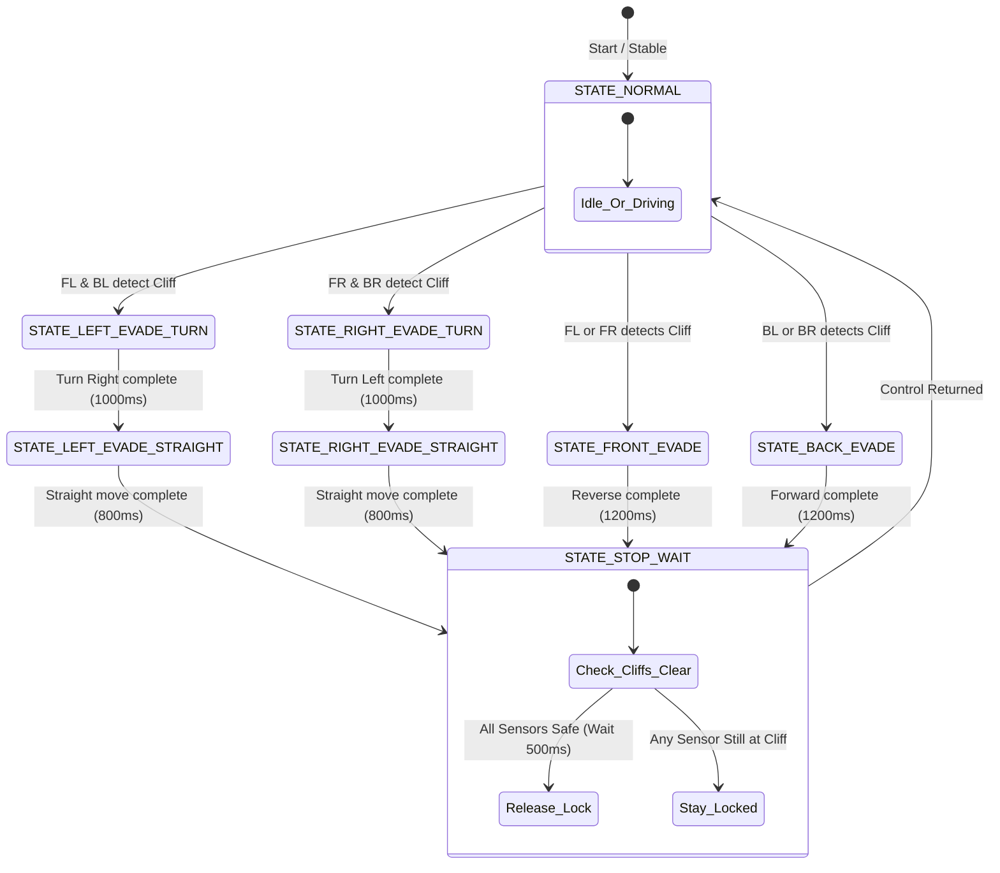
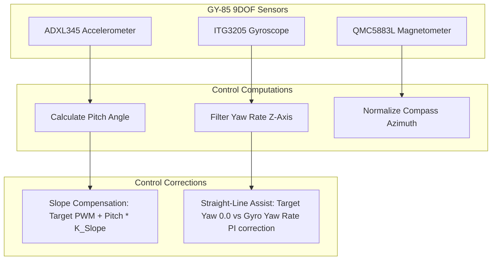

# G7 Solar Panel Cleaning Robot - Walkthrough & System Explanation

This walkthrough covers the **FS80NK Cliff Detection and Evasion System**, the **GY-85 Inertial Sensor Closed-Loop Feedback Control System**, and the newly integrated **WiFi Diagnostics and Verbose Event Logging Systems**.

---

## 🛠️ System Overview & Architectures

The repository provides two separate control system configurations:
1. **Open-Loop Configuration** ([SolarPanelG7RC.ino](file:///c:/Users/Victus/OneDrive/Desktop/IDP/SolarPanelG7RC/SolarPanelG7RC.ino)): Focuses on manual remote control (RC) and the autonomous safety cliff-detection and evasion system powered by four FS80NK infrared proximity sensors.
2. **Closed-Loop Configuration** (in the [SolarPanelG7RC_ClosedLoop](file:///c:/Users/Victus/OneDrive/Desktop/IDP/SolarPanelG7RC/SolarPanelG7RC_ClosedLoop) folder): Re-integrates the GY-85 IMU to implement straight-line assist heading correction and slope speed compensation, and provides real-time PID slider tuning directly from the web dashboard.

---

## 🚦 Safety Evasion State Machine (Both Versions)

Both versions utilize a non-blocking state machine `updateSafety()` running on the ESP32. If a cliff sensor detects the edge (outputs active `HIGH`), manual RC and presets are instantly bypassed to execute an evasion maneuver:

---

## 🧭 Closed-Loop Stabilization Loop (`SolarPanelG7RC_ClosedLoop`)

In the closed-loop version, when the safety state is normal, the robot uses the GY-85 IMU to compensate for tilts and rotation:

### 1. Mathematical Logic
* **Slope Compensation**: When driving forward or backward, pitch tilt gravity pull is countered by adjusting the base speed:
  $$V_{\text{compensated}} = V_{\text{target}} + \theta_{\text{pitch}} \times K_{\text{slope}}$$
* **Straight-Line Lock**: When driving straight, yaw rotation rate is locked to `0` using a PI loop:
  $$e(t) = 0 - Y_{\text{rate}}(t)$$
  $$u(t) = K_p e(t) + K_i \int e(t) dt + K_d \frac{de(t)}{dt}$$
  $$L_{\text{output}} = V_{\text{compensated}} + u(t)$$
  $$R_{\text{output}} = V_{\text{compensated}} - u(t)$$

---

## 💻 Web Dashboard Upgrades

The closed-loop version's dashboard is fully upgraded with:
1. **Compass Card**: Integrates a virtual needle reflecting the magnetometer's azimuth.
2. **3D Tilt Orientation Card**: Embeds a CSS 3D transformed disk displaying the physical inclination (pitch/roll) of the robot.
3. **PID Tuning Card**: Adds interactive sliders to modify $K_p$, $K_i$, and $K_d$ values on the ESP32 in real time with a 150ms debouncer.

---

## 🛡️ Safety Override / Mode Switcher

To prevent motor control lockouts when the **FS80NK cliff detection sensors** are physically disconnected (which otherwise pull the ESP32 input pins to the `CLIFF_STATE` and cause the system to think a cliff is constantly detected), we implemented a **Safety Mode Switcher**:
* **Default Behavior**: On system boot, Safety Mode defaults to **Bypassed (Normal Mode)** (`safetyModeActive = false`). This ensures the robot is fully drivable immediately, ignoring the status of the cliff sensors.
* **Safety/Cleaning Mode**: When activated, the safety state machine functions normally, triggering automatic reversing or turning behaviors whenever a cliff edge is detected.
* **Switching Mechanisms**:
  1. **Web UI Button**: Clicking the "Enable Safety/Cleaning" button on the dashboard toggles the mode. The UI immediately transitions to green and updates the button label to "Disable Safety/Cleaning".
  2. **Game Controller**: Pressing the **Right Bumper / Button R1** (`gp.buttons[5]`) on an active gamepad toggles the mode instantly.
* **Immediate Recovery**: If safety mode is bypassed while the robot is in a locked or evading safety state, the motor locks are immediately released, setting the state back to `STATE_NORMAL` and returning motor control to the remote control (RC) or playback routines.

---

## 🔠 Dashboard UTF-8 Charset Fix

Previously, characters such as emojis (e.g., `🎮`, `🤖`, `⚠️`, `🧭`) could display as corrupt byte sequences (gibberish) depending on the user's browser language and default decoding settings. 
* **Solution**: Explicitly added `<meta charset="UTF-8">` to the HTML `<head>` section in both standard (`SolarPanelG7RC.ino`) and closed-loop (`SolarPanelG7RC_ClosedLoop.ino`) firmware versions. This forces browsers to render Unicode symbols cleanly and reliably.

---

## 📶 WiFi Diagnostics & Verbose Event Logging

We implemented a real-time WiFi telemetry reporting system and verbose firmware-level event logging:

### 1. WiFi & Connection Quality Diagnostics
- **Client RSSI (dBm)**: ESP32 queries the signal strength of the connected client station using `esp_wifi_ap_get_sta_list()` and reports it in the `/status` JSON response.
- **Client Count**: Displays the number of connected stations via `WiFi.softAPgetStationNum()`.
- **Latency (RTT) Feedback**: The browser tracks the latency of each `/status` poll and sends it back to the ESP32 via `/status?rtt=XXX`. If latency exceeds `350ms`, the ESP32 logs it automatically to prevent issues.
- **WiFi Health Indicators**: The dashboard now visualizes:
  - Real-time WiFi Signal Strength in dBm (color-coded: Green for strong signal, Yellow for medium, Red for weak).
  - Connected Station count.

### 2. Verbose Log Triggers
We added descriptive categories and events logged directly in the ESP32 circular buffer:
- `[REC] Saved preset: X steps` (when preset is saved)
- `[REC] Preset cleared` (when cleared)
- `[PLAY] Started playback` or `[PLAY] Resumed playback` (when playback starts/resumes)
- `[PLAY] Playback paused at step X` (when playback is paused)
- `[PLAY] Playback stopped` (when playback is stopped)
- `[PLAY] Playback complete` (when playback reaches the end)
- `[WiFi] Weak signal: -XX dBm` (warning logged when RSSI drops below -80 dBm)
- `[WiFi] Signal restored` (logged when RSSI returns above -75 dBm)
- `[WiFi] High latency: XXX ms` (logged when client-reported latency exceeds 350ms)

All these categories are custom-styled (e.g. Violet for WiFi, Orange for REC, Cyan for PLAY) in the scrollable log card.
