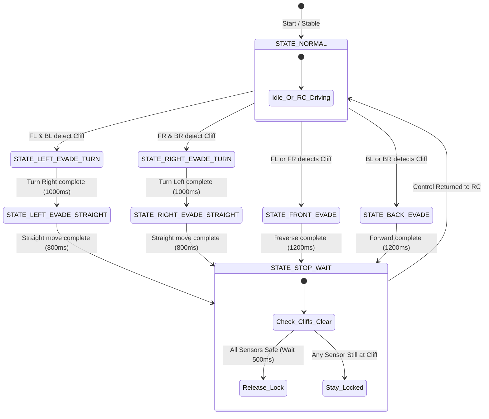

# Walkthrough - Cliff Detection and Evasion System

We have successfully replaced the GY-85 IMU integration with a robust **FS80NK infrared cliff detection system** on the G7 Solar Panel Cleaning Robot.

---

## 🛠️ Summary of Changes

### 1. Hardware Definition & Setup (`SolarPanelG7RC.ino`)
- **IMU Cleanup**: Removed GY-85 IMU references, variables, and headers (`Adafruit_Sensor.h`, `Adafruit_ADXL345_U.h`, `QMC5883LCompass.h`).
- **I2C Safety**: Kept I2C peripheral initialized on `GPIO 21, 22` untouched so that user hardware wiring and future extensions are not disrupted.
- **Cliff Sensor Pins**: Configured the 4 corners of the robot to general purpose pins with internal pull-up support:
  * **Front-Left (FL)**: `GPIO 32`
  * **Front-Right (FR)**: `GPIO 33`
  * **Back-Left (BL)**: `GPIO 27`
  * **Back-Right (BR)**: `GPIO 14`
- **Electrical Active State**: Wired using `INPUT_PULLUP`. The FS80NK outputs `LOW` (0) when a surface is detected, and pulls `HIGH` (1) when open air (cliff/edge) is encountered. Logic condition: `#define CLIFF_STATE HIGH`.

---

## 🚦 Safety Evasion State Machine

We implemented a non-blocking state machine `updateSafety()` in the `loop()` of the ESP32. The system checks sensor flags and runs autonomous maneuvers:

### State Machine Flowchart Diagram (Mermaid code):

### Safety Rules Applied:
1. **RC Input Lock**: While `safetyState != STATE_NORMAL`, any incoming joystick or motor drive commands are ignored. The robot handles its own recovery.
2. **Serial Troubleshooting**: High-level telemetry is printed to the Arduino Serial Monitor (`115200` baud) indicating exactly which sensor triggered the override, motor power outputs, and recovery progress.

---

## 💻 Dashboard Redesign

The HTML dashboard served at `http://<ESP32_IP>/` was completely updated:
- **Cleaned Dashboard**: Removed the Accelerometer, Compass, Pitch & Roll, and Gyroscope cards.
- **Top-Down Robot Visualizer**: 
  - Displays a graphical rendering of the square robot from a top view, styled with modern glassmorphism.
  - Features visual representations of the **cleaning brush roller** at the front and solar panels on the body.
  - Places four blinking **sensor indicators** at the corners (FL, FR, BL, BR).
  - Indicators are **Green** (breathing) when the robot is safe, and turn **Blinking Red** when a cliff is detected.
- **Troubleshooting Card**: Lists exact pin mappings and diagnostic states.
- **Safety Banner Alert**: Displays a blinking warning bar at the top of the browser window indicating the active safety override state (e.g. `⚠️ SAFETY INTERRUPT: EVADING FRONT (RC DISABLED)`).

---

## 🎙️ Preset Recorder & Autonomous Playback

We implemented an autonomous playback preset system using a hybrid browser-firmware architecture:
- **10 Hz Sampling**: The browser records your manual motor controls (`leftPWM`, `rightPWM`) and pump relay actions (`pumpState`) at 10 Hz intervals.
- **ESP32 Local Storage**: Once recording stops, the browser compiles the step sequence and sends it to the ESP32 via a single compact `POST /upload_preset` request. The ESP32 stores it locally in RAM (supporting up to 3000 steps / 5 minutes, using ~15 KB).
- **Autonomous Local Execution**:
  - The ESP32's C++ loop executes playback instructions at strict 100ms intervals, providing smooth offline locomotion.
  - While playback is active, manual RC inputs are ignored.
  - **Failsafe**: If a cliff is detected, the playback instantly pauses, stopping the motors and allowing the safety override evasion maneuvers to execute cleanly.
- **Timeline & Telemetry Sync**: The `/status` route returns real-time playback cursor indices (`playIndex` and `playLen`) to drive the dashboard progress bar timeline.

---

## 🔍 Verification & Troubleshooting Instructions

1. **Static Test**:
   - Power the ESP32 and open the Serial Monitor.
   - Open the web dashboard. All 4 sensors should start **Green / Safe** (when pointing at the solar panel surface).
2. **Triggering Individual Sides**:
   - Lift the front of the robot off the panel. The front indicators (FL, FR) should turn **Blinking Red** on the dashboard, a warning banner will appear, and the motors will run in reverse.
   - Place the robot back down. Control should return to the Gamepad after `500ms`.
   - Lift the left side of the robot (FL, BL). The robot should pivot right, drive forward, and stop until safe.
3. **Distance Calibration**:
   - If the sensors trigger too early or fail to detect the panel edge, use a small screwdriver on the rear adjustment dial of the FS80NK to set the range.
